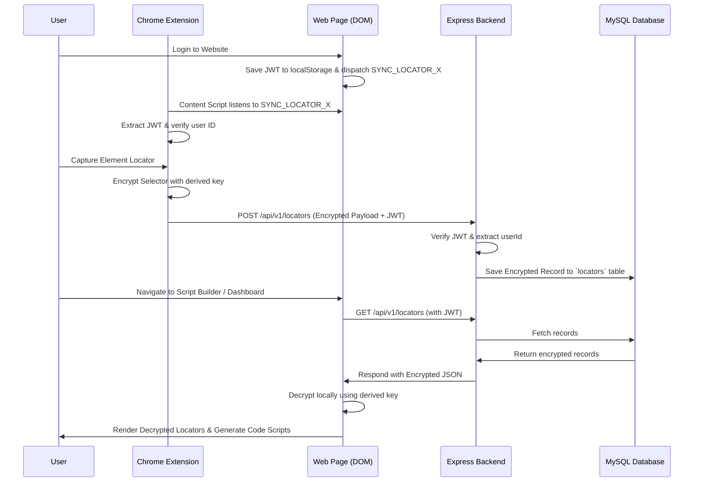

# Browser Extension & Website Locator Synchronization Specification

This document details the architecture, encryption protocols, and synchronization workflows to securely transfer test locators from the **LocatorX Browser Extension** to the **LocatorX Website Portal** to enable code script generation.

---

## 1. Architecture Overview



The synchronization leverages three communication pillars:
1. **DOM Page Bridge**: The extension content script listens to custom events dispatched by the website on the same origin.
2. **Shared Authentication Session**: The extension dynamically loads the JWT session token from the website's localStorage, ensuring sync is only possible when both interfaces are logged into the **same user account**.
3. **End-to-End Encryption (E2EE)**: Selectors are encrypted on the browser extension before transmission, stored in their encrypted form in the database, and decrypted client-side in the web dashboard. The backend server never sees the raw element selectors.

---

## 2. Same-Login Validation Mechanism

To ensure data only syncs when both the Extension and Website are running under the same credentials:

1. **Website State Dispatching**:
   * When a user logs in successfully, `AuthContext.jsx` saves the authentication token to `localStorage` under `locatorx_token` and dispatches a custom DOM event:
     ```javascript
     document.dispatchEvent(new CustomEvent('SYNC_LOCATOR_X', { 
         detail: {
             id: user.id,
             email: user.email,
             token: session.token
         }
     }));
     ```

2. **Extension Detection**:
   * The extension's `content_script.js` runs automatically on the website domain. It listens to the custom event:
     ```javascript
     document.addEventListener('SYNC_LOCATOR_X', (event) => {
         const session = event.detail;
         if (session && session.token) {
             // Send session data to the extension background script
             chrome.runtime.sendMessage({ type: 'SET_ACTIVE_SESSION', session });
         } else {
             // Clear session when user logs out
             chrome.runtime.sendMessage({ type: 'CLEAR_ACTIVE_SESSION' });
         }
     });
     ```
   * The background script stores this session securely in `chrome.storage.local`.
   * When the extension makes API requests to save captured elements, it appends the extracted website JWT token in the `Authorization: Bearer <token>` header, forcing the backend to authenticate the action under the exact same identity.

---

## 3. Secure End-to-End Encryption (E2EE) Protocol

To guarantee privacy, the locator selector strings are encrypted symmetrically using **AES-256-GCM** via the Web Crypto API.

### Key Derivation
1. The user creates a **Master Encryption Passphrase** (stored locally in `chrome.storage.local` on the extension and `localStorage` on the website; never sent to the backend).
2. The system derives a 256-bit AES key using **PBKDF2** with:
   * **Hash algorithm**: SHA-256
   * **Iterations**: 100,000
   * **Salt**: A static user-specific salt (derived from the user's ID or unique registration timestamp).

### Encryption (Extension Side)
Before sending the locator to the server, the extension encrypts the `selector` string:
```javascript
async function encryptSelector(rawSelector, key) {
    const iv = window.crypto.getRandomValues(new Uint8Array(12)); // 12-byte IV for GCM
    const encoded = new TextEncoder().encode(rawSelector);
    
    const ciphertextBuffer = await window.crypto.subtle.encrypt(
        { name: "AES-GCM", iv: iv },
        key,
        encoded
    );
    
    return {
        ciphertext: btoa(String.fromCharCode(...new Uint8Array(ciphertextBuffer))),
        iv: btoa(String.fromCharCode(...iv))
    };
}
```

### Decryption (Website Side)
The database stores `{ ciphertext, iv }` in place of the raw selector. The website retrieves the payload and decrypts it locally:
```javascript
async function decryptSelector(ciphertextBase64, ivBase64, key) {
    const iv = new Uint8Array(atob(ivBase64).split("").map(c => c.charCodeAt(0)));
    const ciphertext = new Uint8Array(atob(ciphertextBase64).split("").map(c => c.charCodeAt(0)));
    
    const decryptedBuffer = await window.crypto.subtle.decrypt(
        { name: "AES-GCM", iv: iv },
        key,
        ciphertext
    );
    
    return new TextDecoder().decode(decryptedBuffer);
}
```

---

## 4. Script Generation Flow

Once the locators are decrypted in the web portal, users can import them directly into a **Code Script Generator** panel:

1. **Locator Selection**: A checkbox list lets the user choose which elements they want to automate (e.g. `login_email_input`, `login_password_input`, `submit_button`).
2. **Framework Selection**: Users can choose their target automation frameworks:
   * **Playwright** (JS/TS or Python)
   * **Selenium WebDriver** (Python or Java)
   * **Cypress** (JS/TS)
3. **Template Engine**: The website compiles the selected locators into a complete test block using pre-coded framework syntax:
   * *Example Playwright JS Output*:
     ```javascript
     const { test, expect } = require('@playwright/test');

     test('Generated Automation Script', async ({ page }) => {
         await page.goto('https://example.com/login');
         
         // Imported Locators
         await page.fill('//input[@id="email"]', 'your-email@example.com');
         await page.fill('//input[@id="password"]', 'your-password');
         await page.click('//button[@type="submit"]');
         
         await expect(page).toHaveURL('https://example.com/dashboard');
     });
     ```
4. **Export Options**: Interactive copying or downloading (`.js`/`.py`/`.spec.js`) directly from the browser.

---

## 5. Development Checklists

### What to do in the Extension
- [ ] **Content Script (`content.js`)**:
  * Set up listener for `'SYNC_LOCATOR_X'` custom DOM events.
  * Listen to document changes to verify if user logs out or switches accounts.
- [ ] **Background Worker (`background.js`)**:
  * Store the shared JWT token securely in `chrome.storage.local`.
  * Validate token expiration periodically.
- [ ] **Encryption Module (`crypto.js`)**:
  * Implement Web Crypto API logic (PBKDF2 key derivation and AES-GCM 256 encryption/decryption).
  * Prompt user to configure their "Master Passphrase" on first launch.
- [ ] **Inspector/Capture Popup (`popup.js` / overlay)**:
  * Capture selectors, encrypt the selector field, and dispatch the API request using the shared JWT token as the Authorization header.

### What to do in the Website
- [ ] **Database Schema Update (`locator` model)**:
  * Replace the `selector` text field with two fields: `encrypted_selector` (TEXT) and `encryption_iv` (VARCHAR).
- [ ] **Authentication Context (`AuthContext.jsx`)**:
  * Ensure the custom DOM dispatch event (`SYNC_LOCATOR_X`) is fired on auth state updates.
- [ ] **Playground & Vault Panels**:
  * Add a "Master Passphrase" modal prompt on entering the vault.
  * Derive the decryption key locally and decrypt the selectors on-the-fly for rendering.
- [ ] **Script Builder Component**:
  * Create a code canvas component that lets users import multiple locators.
  * Define framework-specific script generation templates.
