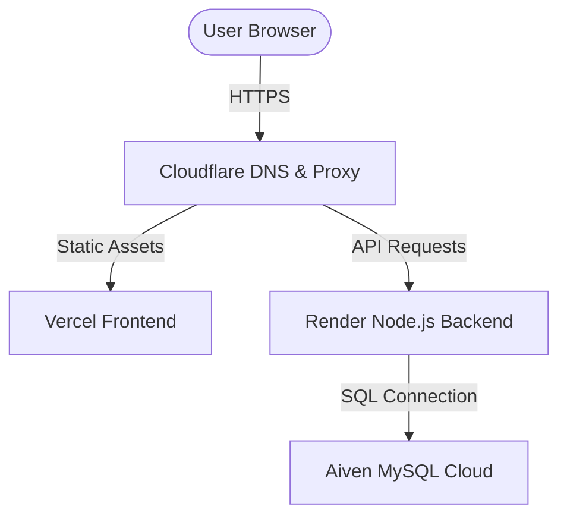

# LocatorX Free Hosting & Deployment Guide

This guide details how to host and deploy the **LocatorX Website Portal**, **Express Backend API**, and **MySQL Database** for **completely free ($0/month)** using modern cloud hosting solutions.

---

## Architecture Overview

---

## Phase 1: Deploy the MySQL Database (Aiven)
Your backend connects to a MySQL instance. We use **Aiven** because it offers a fully-managed database on its Free Tier.

1. **Sign Up:** Create a free account at [aiven.io](https://aiven.io/).
2. **Create Service:**
   - Select **MySQL** as your service type.
   - Choose the **Free Plan** (available in AWS `us-east-1` or `eu-west-1` zones).
   - Click **Create Service**.
3. **Capture Credentials:**
   Once the database state transitions to *Running*, copy the following variables from the connection dashboard:
   - **Host:** `mysql-XXXX.aivencloud.com`
   - **Port:** `12345` (Aiven uses non-standard ports for safety)
   - **User:** `avnadmin`
   - **Password:** *(Copy generated password)*
   - **Database:** `defaultdb`

---

## Phase 2: Deploy the Backend API (Render)
**Render** hosts Node.js Express servers. It provides free SSL and handles requests in the cloud.

### Step 1: Git Push
Ensure your local backend code is pushed to a private GitHub repository.

### Step 2: Create Web Service on Render
1. Sign into [render.com](https://render.com/) using your GitHub account.
2. Click **New +** and select **Web Service**.
3. Grant access to your GitHub repo and select it.
4. Set the configuration details:
   - **Name:** `locatorx-backend`
   - **Root Directory:** `backend` *(Crucial, as your backend code resides in the `/backend` subfolder)*
   - **Language:** `Node`
   - **Build Command:** `npm install`
   - **Start Command:** `node server.js`
   - **Instance Type:** Choose **Free** ($0/month).

### Step 3: Configure Environment Variables
Scroll down to the environment variables section and input details matching your [backend/.env](file:///e:/LocatorX/LX-Website/backend/.env) file:

| Variable Name | Value | Description |
| :--- | :--- | :--- |
| `NODE_ENV` | `production` | Enables production optimizations |
| `DB_HOST` | `mysql-XXXX.aivencloud.com` | Your Aiven Hostname |
| `DB_PORT` | `12345` | Your Aiven Port |
| `DB_USER` | `avnadmin` | Default Aiven User |
| `DB_PASSWORD` | `your_aiven_password` | Master Database Password |
| `DB_NAME` | `defaultdb` | Default Database name |
| `JWT_SECRET` | *(64-character random string)* | Secret for signing JWT access tokens |
| `FRONTEND_URL` | `https://your-app.vercel.app` | The address of your Vercel frontend |
| `GEMINI_API_KEY` | `AIzaSy...` | Your Google Gemini API Key |

### Step 4: Launch
Click **Deploy Web Service**. Once deployed, copy your service's URL (e.g. `https://locatorx-backend.onrender.com`).

> [!WARNING]
> Render's free tier web services spin down (go to sleep) after 15 minutes of inactivity. When a request is made after sleep, it triggers a "cold start" which takes ~50 seconds to boot the container back up.

---

## Phase 3: Deploy the Frontend Portal (Vercel)
**Vercel** is optimized for static sites build using Vite + React.

1. Sign into [vercel.com](https://vercel.com/) with GitHub.
2. Click **Add New** > **Project** and select your repository.
3. Apply these settings:
   - **Framework Preset:** `Vite`
   - **Build Command:** `npm run build`
   - **Output Directory:** `dist`
4. Expand **Environment Variables** and add:
   - `VITE_API_URL` = `https://locatorx-backend.onrender.com/api/v1` *(Point to your live Render backend URL)*
5. Click **Deploy**. Vercel will build your static files and generate an HTTPS-secured subdomain (e.g., `https://locatorx.vercel.app`).

---

## Phase 4: Configure DNS & Custom Domain (Cloudflare)
To add a professional custom domain for free without buying expensive certificates:

1. **Setup Cloudflare:** Register a free account at [cloudflare.com](https://cloudflare.com/) and add your custom domain name.
2. **Point Nameservers:** Follow the instructions to change your domain registrar's nameservers to Cloudflare.
3. **Configure DNS Records:**
   - **For React Frontend:** Add a `CNAME` record pointing the root `@` (or `www` subdomain) to Vercel's target: `cname.vercel-dns.com`.
   - **For Express Backend:** Add a `CNAME` record pointing a subdomain (e.g., `api.yourdomain.com`) to your Render domain: `locatorx-backend.onrender.com`.
4. **Enable Proxy/SSL:** Ensure the Cloudflare Cloud Icon (Proxy Status) is set to **Proxied**. Under **SSL/TLS**, set encryption mode to **Full** or **Flexible**.
