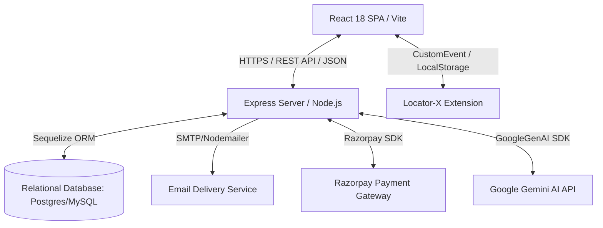

# Technical Requirements Document (TRD) - Locator-X Website

## 1. System Architecture

The Locator-X Website is a full-stack JavaScript application built with a decoupled frontend client and backend API server.



### 1.1. Technology Stack
*   **Frontend SPA:** React 18 (Vite build system, React Router v6, Tailwind CSS for styling, TanStack React Query for data fetching, Radix UI primitives/shadcn for components).
*   **Backend REST API:** Node.js (ES Modules, Express server).
*   **Database & ORM:** Sequelize ORM connecting to PostgreSQL/MySQL database services.
*   **Security & Protection:** Helmet, CORS, Express-Rate-Limit, BCrypt (for password hashing), JWT (for stateless authorization).
*   **External Service Integrations:** Razorpay (payment processing), Nodemailer (transactional emails), `@google/genai` (Gemini chat completions).

---

## 2. API Endpoint Architecture & Versioning

All API routes are prefixed with `/api/v1`. The server configuration registers endpoints via Express router bundles.

### 2.1. Authentication Routes (`/api/v1/auth`)
*   `POST /register` - Registers a new user and profile, sends email verification. Rate-limited.
*   `POST /login` - Validates credentials, issues JWT token. Rate-limited.
*   `POST /verify-email` - Verifies account using activation code. Rate-limited.
*   `POST /resend-verification` - Resends verification code email. Rate-limited.
*   `POST /reset-password-request` - Sends password reset link. Rate-limited.
*   `POST /reset-password` - Resets password with valid token. Rate-limited.
*   `GET /session` - Decodes JWT from header, returns active User and Profile model records.
*   `GET /google` - Initiates Google OAuth sequence.
*   `GET /google/callback` - Callback for Google OAuth token exchange.
*   `GET /github` - Initiates GitHub OAuth sequence.
*   `GET /github/callback` - Callback for GitHub OAuth token exchange.

### 2.2. Profile Routes (`/api/v1/profile`)
*   `GET /` - Fetches the authenticated user's profile metadata. Requires authorization.
*   `PUT /` - Updates profile details (name, settings). Requires authorization.
*   `POST /avatar` - Uploads profile avatar using Multer file middleware. Requires authorization.

### 2.3. Team Routes (`/api/v1/teams`)
*   `POST /` - Creates a new Team. Sets owner as admin and adjusts profile plan to 'team'.
*   `GET /` - Returns all teams the user is member of.
*   `GET /:id` - Fetches single team details, members, and invitation status.
*   `POST /invite` - Generates a 7-day cryptographically secure invite token for an email.
*   `POST /accept-invite` - Consumes token, registers user to `TeamMember`, increments member count.

### 2.4. Locator Sync Routes (`/api/v1/locators`)
*   `GET /` - Retrieves all locators synced to the user's account.
*   `POST /` - Adds or updates a synced locator.
*   `DELETE /:id` - Deletes a synced locator.

### 2.5. Payment Routes (`/api/v1/payment`)
*   `POST /create-order` - Requests order creation from Razorpay in paise.
*   `POST /verify-payment` - Verifies Razorpay HMAC signature, prevents double-spends, and increments subscription block by 30 days.
*   `POST /cancel` - Cancels future pre-booked blocks, issuing refunds minus a cancellation fee.

### 2.6. Promo Code Routes (`/api/v1/promo`)
*   `POST /validate` - Validates promotion code, verifying constraints (active status, user IDs, allowed plans, validity date range, limits) via JSON payload containing `{ code, plan }`.

### 2.7. AI Routes (`/api/v1/ai`)
*   `POST /chat` - Connects to Gemini API (`gemini-2.5-flash`) for selector generation and testing advice.

---

## 3. Core Technical Subsystems

### 3.1. Authentication & Security Middleware
Authentication is verified via a custom Express middleware [authMiddleware.js](file:///e:/LocatorX/LX-Website/backend/middleware/authMiddleware.js):
1.  Extracts the token from the HTTP `Authorization: Bearer <token>` header.
2.  Verifies the JWT signature against the server key `JWT_SECRET`.
3.  Attaches the decoded payload to `req.user` for downstream controllers.
4.  Rate-limiting middleware restricts login/register/reset paths to maximum 100 requests per 15 minutes per IP.

### 3.2. Background Jobs & Cron Engine
The application starts two independent, non-overlapping cron service runners upon server launch:

#### A. Lifecycle Cleanup Worker ([cleanupService.js](file:///e:/LocatorX/LX-Website/backend/utils/cleanupService.js))
*   **Trigger:** Runs daily at midnight `0 0 * * *`.
*   **Logic:**
    1.  *Unverified User Reminders:* Fetches accounts created between 6 and 7 days ago which are not verified. Sends a warning email.
    2.  *Purge unverified:* Deletes all users and cascade profiles created > 7 days ago if `isVerified` remains false.
    3.  *Optimization:* Queries use Sequelize raw attributes and bypass instances overhead to prevent memory leaks under massive registration loads. Processes mail deliveries in chunks of 20.

#### B. Expiries & Subscriptions Worker ([cronJobs.js](file:///e:/LocatorX/LX-Website/backend/utils/cronJobs.js))
*   **Trigger:** Runs daily at midnight `0 0 * * *`.
*   **Logic:**
    1.  *Password Expiries:* Scans user records where `passwordExpiresAt` is exactly 7, 3, or 1 days away. Dispatches email warnings.
    2.  *Plan Expiries:* Scans teams where `planExpiresAt` is exactly 7 or 1 days away. Dispatches subscription warnings to team owners.
    3.  *Optimization:* Dates are pre-calculated to build a single composite OR query condition. User notifications are handled in batches of 20.

### 3.3. Razorpay Subscription & Cancellation Mechanics
#### Order Creation & Payment Verification
1.  Orders are initiated via `razorpay.orders.create`. Client executes Razorpay interface modal.
2.  Payment verification controller checks signature:
    $$\text{Expected Signature} = \text{HMAC-SHA256}(\text{razorpay\_order\_id} + \text{"|"} + \text{razorpay\_payment\_id}, \text{secret\_key})$$
3.  To prevent **Stacking Logic Exploit (Replay Attack)**, the controller queries the `payments` table to verify `razorpayPaymentId` has not been previously processed.
4.  Verifies the actual paid amount against Razorpay API orders resource (checks that it's above minimum threshold for selected plan after discounts).
5.  Updates subscription: If `team.planExpiresAt > now()`, extensions add 30 days onto the future expiry timestamp, rather than current time (protects user's remaining days).

#### Block Cancellation & Refund Calculation
*   Only the team owner can cancel blocks.
*   If `now() < latestPayment.planStartedAt` (the payment was for a future stacked block that hasn't started yet):
    1.  Update payment status to `refunded`.
    2.  Deduct 30 days from `team.planExpiresAt`.
    3.  Set refund amount to:
        $$\text{Refund Amount} = \max(0, \text{Payment Amount} - 50)$$
    4.  Subtract refund amount from `team.totalPaid`.
*   If `now() >= latestPayment.planStartedAt` (active period): Cancelation blocks refund since the block has already commenced.

### 3.4. Local Storage & Client Synchronization
To synchronise credentials and plan tiers with the Locator-X extension, the frontend context [AuthContext.jsx](file:///e:/LocatorX/LX-Website/src/contexts/AuthContext.jsx):
1.  Saves a token to `localStorage.setItem('locatorx_token', token)`.
2.  Updates `localStorage.setItem('locatorx_current_user', JSON.stringify(userData))`.
3.  Fires a document-level event:
    ```javascript
    document.dispatchEvent(new CustomEvent('SYNC_LOCATOR_X', { detail: userData }));
    ```
4.  The extension content script captures this custom event and reads the current user session/plan details to adjust limits locally.
