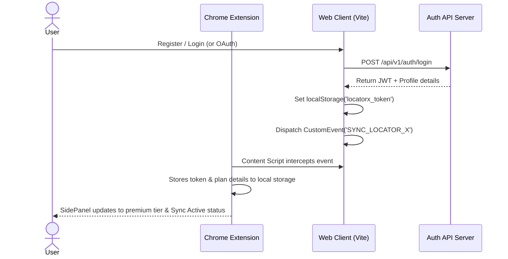

# App Flow / UI UX Brief - Locator-X Website

## 1. Visual Design System

The Locator-X Website features a high-end, responsive developer interface designed to feel modern and premium. It features glassmorphism accents, crisp grids, and dynamic dark/light theme switching.

### 1.1. Color Palette Tokens (Tailwind Tailwind/CSS Configuration)

The design system employs the following semantic colors:

*   **Primary/Canvas Background:** `#090d16` (Dark Mode) / `#ffffff` (Light Mode).
*   **Secondary/Card Background:** `#121826` (Dark) / `#f8fafc` (Light) - featuring subtle transparency (`bg-opacity-80`) and `backdrop-blur-md` filters.
*   **Branding & Accent Color:** `#0284c7` (Sky Blue / Primary) / `#7e22ce` (Purple / Accent) / `#3b82f6` (Indigo / Secondary Accent).
*   **Borders:** `rgba(255, 255, 255, 0.06)` (Dark) / `rgba(0, 0, 0, 0.06)` (Light).
*   **Typography:** Primary sans-serif font family is **Inter** or **Outfit** for headers. Monospace typography (**JetBrains Mono** or **Fira Code**) is used for selector inputs, XPath displays, database IDs, and configuration JSON tables.

### 1.2. Design Details & Accessibility
*   **Focus Ring:** Highlight interactive inputs and buttons with custom focus indicators (`focus-visible:ring-2 focus-visible:ring-sky-500`).
*   **Transitions:** Every hover state, tab switch, and modal open must employ smooth transitions (`transition-all duration-200 ease-out`).
*   **Responsive Framework:** Layout shifts from multi-column grids on desktop to stacked forms on mobile interfaces.

---

## 2. Core Layouts & Page Frameworks

### 2.1. Cloud Dashboard (`/dashboard`)
*   **Metric Grid:** Displays widgets showing "Total Synced Locators", "Active Pages", "Team Synced Elements", and "Current Billing Cycle Expiry".
*   **Page Registry Tree:** Left-hand list showing virtual page components (e.g. `LoginPage`, `CheckoutView`).
*   **Locator Data Table:** Displays synced records with columns: Tag name, Locator Type (CSS/XPath), Selector Pattern, and Target Page. Each row has quick actions: Copy Selector, Edit, Delete.

### 2.2. Interactive Playground (`/playground`)
The playground is a testing grid comprising tabs that simulate modern UI components:
*   **Data System Tab:** Renders pagination lists, active sort rows, and data tables. Useful for exercising relative index locators.
*   **Checkout Suite:** An ecommerce card that increments/decrements quantity, displays tax computations, and promo codes.
*   **Form Validation:** Renders input states that validate fields (email format, password strength) in real time, triggering error text elements.
*   **Modal System:** Interactive button triggering nested popups, testing target overlays.
*   **Rating System:** Visual star review grid to practice locating complex interactive widgets.
*   **Shadow Host & Frame Enclosures:** Renders a nested iframe containing a Shadow DOM host root, allowing developers to test deep selector traversing tools.

### 2.3. Team Management Portal (`/team`)
*   **Members Grid:** Lists user profiles, avatars, emails, roles (Admin, Member, Viewer), and date joined.
*   **Invite Module:** Input block to trigger email invitations and specify role assignment.
*   **Billing/Subscription Panel:** Displays active plan tier, pricing currency toggles (INR/USD), and payment invoices. Contains buttons for Upgrade (Pro/Teams) or Cancel stack block.

### 2.4. AI Chatbot Widget (Floating Overlay)
*   A chat interface positioned at the bottom-right corner of the application screen. Renders a welcome message, custom user input field, and code-block formatted output for generated xpath/css snippets.

---

## 3. Core Interaction & User Flows

### 3.1. Authentication & Sync Flow

### 3.2. Team Creation & User Invitation Flow
1.  Owner navigates to `/team` and inputs Team Name.
2.  Server creates the Team, links the Owner as Admin in `TeamMember`, and upgrades profile plan to 'team'.
3.  Owner enters colleague's email (`colleague@company.com`) and selects role `member`.
4.  Server generates a cryptographically secure token and emails an invitation link (`/join-team?token=...`).
5.  Colleague logs in, visits the invitation URL, accepts, and joins the team. Both user dashboards now display the shared team locator database.

### 3.3. Razorpay Subscription & Stacking Flow
1.  User clicks **Upgrade to Pro** on `/pricing` or `/team`.
2.  Payment controller creates Razorpay order in backend.
3.  Razorpay checkout overlay renders over the website, requesting card/UPI details.
4.  Upon payment success, Razorpay client returns verification signatures.
5.  Web client sends signatures, team ID, and target plan name to `/api/v1/payment/verify-payment`.
6.  Server validates signature, verifies database replay protection, calculates plan start/expiry stacking dates (+30 days), updates team database, and sends success notification.

---

## 4. UI Polish & Micro-interactions
*   **Clipboard Copy Alert:** Clicking any locator string copies it to the clipboard and triggers a bottom-right toast message (`"Copied to clipboard!"` in a green status bubble).
*   **Plan Expiry Warning Banner:** If the team plan expires in less than 7 days, a sticky banner appears at the top of the dashboard containing a link to the checkout upgrade page.
*   **Loading States:** Actions like checking out, loading tables, or sending AI requests display progress spinner rings or skeleton loading cards to maintain visual continuity.
